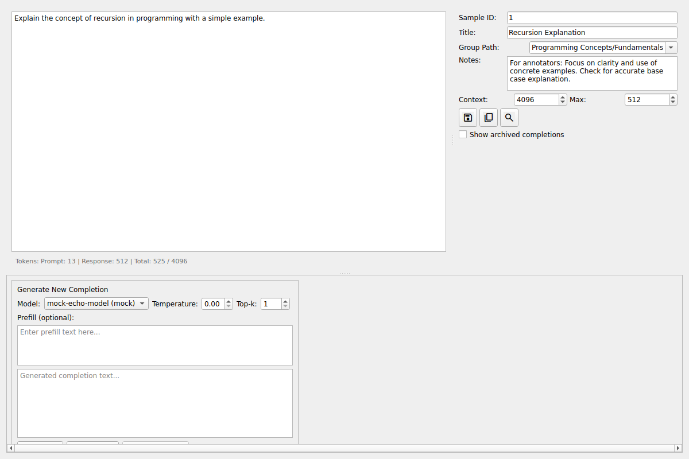

# Sample Notes Feature

## Overview

The Sample Notes feature allows users to add internal notes to samples that are intended for annotators but not visible to models. This is useful for recording non-trivial questions, annotation guidelines, or other context that should be preserved with the sample.

## UI Location

The notes field is located in the sample control panel, positioned after the "Group Path" field and before the "Context" and "Max" token fields.



## Field Specifications

- **Field Type**: QPlainTextEdit (multiline text input)
- **Height**: Approximately 2 lines (60px maximum)
- **Label**: "Notes:"
- **Placeholder**: "Add notes for annotators (not visible to models)..."
- **Position**: Control panel, after Group Path field

## Database Schema

The `notes` field is added to the `samples` table:

```python
notes: Mapped[str | None] = mapped_column(String, nullable=True)
```

- **Type**: Nullable String
- **Default**: None
- **Persistence**: Saved with sample metadata

## Usage

### Creating New Samples with Notes

1. Enter your prompt text
2. Fill in the sample title and group path (optional)
3. Add notes in the "Notes:" field
4. Click Save

The notes will be stored with the sample and can be edited later.

### Editing Existing Sample Notes

1. Open an existing sample
2. Modify the text in the "Notes:" field
3. Click Save

Changes to notes are saved immediately without affecting the prompt or completions.

### Notes Behavior

- **Empty notes**: Empty strings are automatically converted to NULL in the database
- **Multiline support**: Notes can contain multiple lines with newlines
- **Special characters**: Full Unicode support including emoji and international characters
- **Copying samples**: Notes are preserved when using the "Copy Sample" feature

## Implementation Details

### Modified Files

1. **py_fade/dataset/sample.py**
   - Added `notes` field to Sample ORM model
   - Updated `create_if_unique()` method to accept notes parameter
   - Updated `new_copy()` method to preserve notes

2. **py_fade/gui/widget_sample.py**
   - Added QPlainTextEdit widget for notes input
   - Updated `setup_ui()` to include notes field in layout
   - Updated `set_sample()` to populate notes from sample data
   - Updated `save_sample()` to persist notes changes

### Test Coverage

Comprehensive test coverage includes:

- **Database tests** (9 tests): Sample creation, persistence, updates, copying, and edge cases
- **UI tests** (12 tests): Widget creation, display, editing, saving, and integration

All 265 existing tests continue to pass.

## Example Use Cases

1. **Annotation Guidelines**: "For annotators: Focus on clarity and use of concrete examples. Check for accurate base case explanation."

2. **Quality Criteria**: "Expected answer should demonstrate understanding of recursion with proper base case and recursive case."

3. **Edge Cases**: "This sample tests handling of negative numbers. Verify proper error handling."

4. **Context**: "Based on user feedback that previous responses were too technical. Aim for simpler explanations."

## Future Enhancements

Potential improvements to consider:

- Rich text formatting support
- Markdown rendering
- Notes templates
- Search/filter by notes content
- Notes history/versioning
